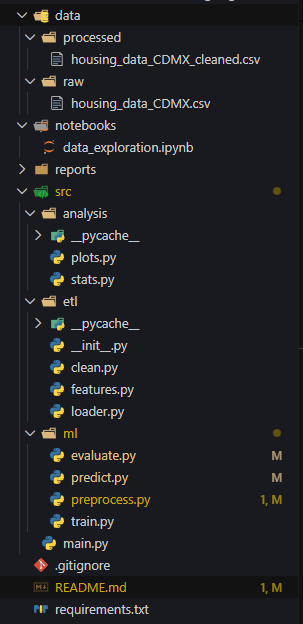

# 🏠 Previsão de Preços de Imóveis – CDMX (Machine Learning)

Este projeto utiliza **Machine Learning supervisionado** para prever o preço de imóveis na Cidade do México, com base em variáveis como tamanho do imóvel, localização (latitude/longitude), tipo de propriedade e outros atributos.

O objetivo principal é aplicar técnicas de:

- **ETL (Extração, Transformação e Limpeza de Dados)**
- **Análise Exploratória de Dados (EDA)**
- **Criação de Features (Feature Engineering)**
- **Treinamento e Avaliação de Modelos de Regressão**
- **Predição de preços de novos imóveis**

O projeto foi modularizado seguindo boas práticas de engenharia de software, ideal para fins educacionais e profissionais.

---

# 📂 Estrutura do Projeto



---

# 🎯 Objetivo do Projeto

Criar um pipeline completo de aprendizado de máquina capaz de:

1. **Carregar** e inspecionar os dados.
2. **Limpar** inconsistências e valores ausentes.
3. **Criar novas variáveis** relevantes para melhorar o desempenho dos modelos.
4. **Treinar algoritmos supervisionados de regressão**, como:
   - Regressão Linear
   - Random Forest Regressor
5. **Avaliar o desempenho** usando:
   - MSE (Mean Squared Error)
   - R² Score
6. **Realizar previsões em novos imóveis**, informando preço estimado.

---

# 🔄 Pipeline do Projeto

## 1️⃣ ETL — Extração e Limpeza

### ✔ Extração
O arquivo `housing_data_CDMX.csv` é carregado usando `etl/loader.py`.

### ✔ Limpeza
No arquivo `etl/clean.py`, são executadas:
- remoção de duplicatas
- remoção de valores ausentes
- remoção de outliers simples (dados com valores impossíveis)

### ✔ Feature Engineering
Em `etl/features.py`, novas colunas são criadas, como:
- **price_per_m2** → preço por metro quadrado  
- **difference** → área total – área coberta  
- **area_ratio** → porcentagem da área coberta  
- Codificação de variáveis categóricas numéricas

---

# 📊 2️⃣ Análise Exploratória de Dados

Os módulos em `analysis/` geram:
- histogramas de distribuição
- estatísticas descritivas
- possíveis correlações entre variáveis

Isso ajuda a entender o comportamento do preço e identificar padrões relevantes.

---

# 🤖 3️⃣ Treinamento dos Modelos

Em `ml/train.py`, modelos como:
- **LinearRegression**
- **RandomForestRegressor**

são treinados usando um `Pipeline` com:
- `StandardScaler()`  
- modelo final

O pré-processamento e separação treino/teste ficam em `preprocess.py`.

---

# 🧪 4️⃣ Avaliação dos Modelos

Em `ml/evaluate.py`, cada modelo é avaliado com:

| Métrica | Descrição |
|--------|-----------|
| **MSE (Mean Squared Error)** | Erro médio ao quadrado |
| **R² Score** | Quanto o modelo explica da variação dos dados |

O relatório é exibido no console no final da execução.

---

# 🔮 5️⃣ Predição de Novo Imóvel

Você pode prever o preço de um imóvel passando um dicionário com os atributos:

```python
novo_imovel = {
    "surface_total_in_m2": 100,
    "surface_covered_in_m2": 90,
    "price": 0,
    "price_aprox_local_currency": 0,
    "price_aprox_usd": 0,
    "price_per_m2": 0,
    "latitude": 19.4,
    "longitude": -99.1,
    "difference": 10,
    "area_ratio": 0.9,
    "property_type_encoded": 1,
    "places_encoded": 2,
    "currency_encoded": 0
}
